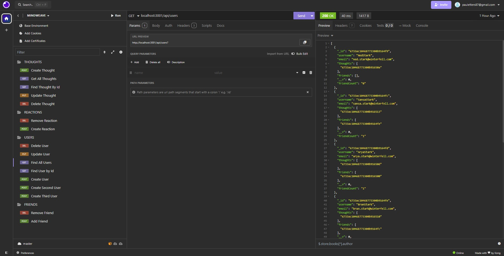

  

# Mindweave

## Description
Mindweave is a social networking API that allows you to do a variety of cool things such as:
- Create a user
- Update a user
- Delete a user
- Find all users
- Find a user by their id
- Add a friend
- Remove a friend
- Create a thought
- Update a thought
- Delete a thought
- Find all thoughts from users
- Find a single user's thoughts by their id
- Create a reaction to a user's thoughts
- Remove a reaction

This app will allow multiple users to share their thoughts with their friends and allow their friends to respond to their thoughts. A great way to stay connected with friends and family!

## Table of Contents
- [Installation](#installation)
- [Usage](#usage)
- [License](#license)
- [Contributing](#contributing)
- [Tests](#tests)
- [Questions](#questions)

## Installation
This app uses Node, Express, Typescript,  MongoDB, and Mongoose. Make sure to do an npm install to get access to all of the necessary node modules as well as create your own gitignore.

## Usage
To begin, in your terminal type npm run dev. This will build the database, seed it with data, and connect it to the server. Once this is complete, pull up your Insomnia (or comparable program) for testing. 

- To find all users: GET at localhost:3001/api/users
- To find a user by id: GET at localhost:3001/api/users/:userId, then the user id as a parameter
- To create a user: POST at localhost:3001/api/users/:userId, then the user id as a parameter. The body must include a username and email.
- To update a user: PUT at localhost:3001/api/users/:userId, then the user id as a parameter. The body must include a username and email.
- To remove a user: DELETE at localhost:3001/api/users/:userId, then the user id as a parameter.
- To add a friend: POST at localhost:3001/api/users/:userId/friends/:friendId, then the user id and friend id as parameters.
- To Remove a friend: DELETE at localhost:3001/api/users/:userId/friends/:friendId, then the user id and friend id as parameters.
- To find all thoughts: GET at localhost:3001/api/thoughts
- To find a thought by id: GET at localhost:3001/api/thoughts/:thoughtId, then the thought id as a parameter.
- To create a thought: POST at localhost:3001/api/thoughts, then for the body include a thoughtText, username, and userId.
- To update a thought: PUT at localhost:3001/api/thoughts/:thoughtId, then the thought id as a parameter using the same body for creating a thought.
- To remove a thought: DELETE at localhost:3001/api/thoughts/:thoughtId, then the thought id as a parameter.
- To create a reaction: POST at localhost:3001/api/thoughts/:thoughtId/reactions, then the thought id. The body must include a reactionBody and username.
- To remove a reaction: DELETE at localhost:3001/api/thoughts/:thoughtId/reactions/:reactionId, then the thought id and reaction id as your paramters.

Feel free to check out the test video under the test section to see the app in use on Insomnia for further understanding of usage!

  ## License
    MIT
    
  https://opensource.org/licenses/MIT

## Contributing
N/A

## Tests
Below is a link to a video of the app being used in Insomnia. Take a look! 

https://drive.google.com/file/d/1nforc0ktOodGv15P-7Cc1CdCoKBbjRFF/view?usp=sharing

## Questions
GitHub: [pauletters](https://github.com/pauletters)
Email: pauletters87@gmail.com

© 2024 Mindweave Team Confidential and Proprietary. All Rights Reserved.
